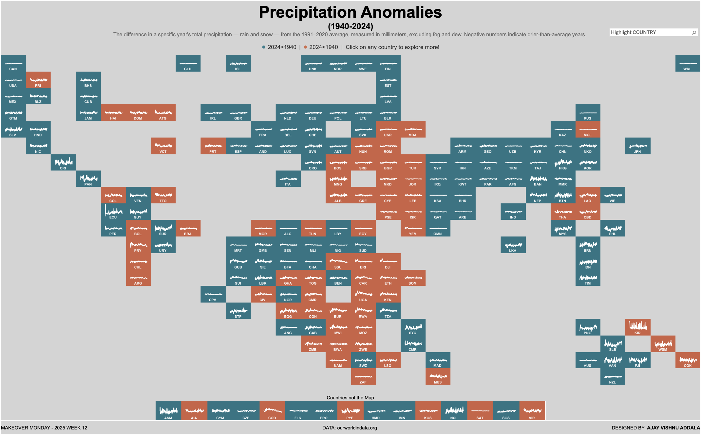

# Precipitation Anomalies Dashboard

This Tableau project visualizes global precipitation anomalies from 1940 to 2024, comparing each country's data to world averages. It features interactive elements to explore country-specific insights and global trends.

## Features

- **World Tile Map**: Each country's tile contains a line chart of precipitation anomalies over the years.
- **Color Coding**: Tiles are color-coded to indicate whether 2024 precipitation is greater or less than 1940.
- **Interactive Country View**: Clicking on a country displays a detailed view:
  - **Country vs. World Bar Chart**: Shows precipitation anomalies by year for the selected country.
  - **World Gantt Chart Overlay**: Displays world averages overlapped with country data, color-coded by whether the country exceeded or fell below world averages each year.

## Snapshot

## Tableau Dashboard Link
[Explore the Dashboard](https://public.tableau.com/views/PrecipitationAnomaliesMOM2025W12/MOM2025W12?:language=en-US&:sid=&:redirect=auth&:display_count=n&:origin=viz_share_link)

## Data Source
- The dataset includes precipitation anomalies measured in millimeters, excluding fog and dew.
- Anomalies are calculated as the difference from the 1991–2020 average.

## Usage
1. Open the Tableau dashboard using the link provided.
2. Hover over tiles to view precipitation anomaly trends.
3. Click on a tile to explore detailed comparisons for a specific country.

## Feedback
Feel free to open an issue or contact me for any suggestions or feedback!
